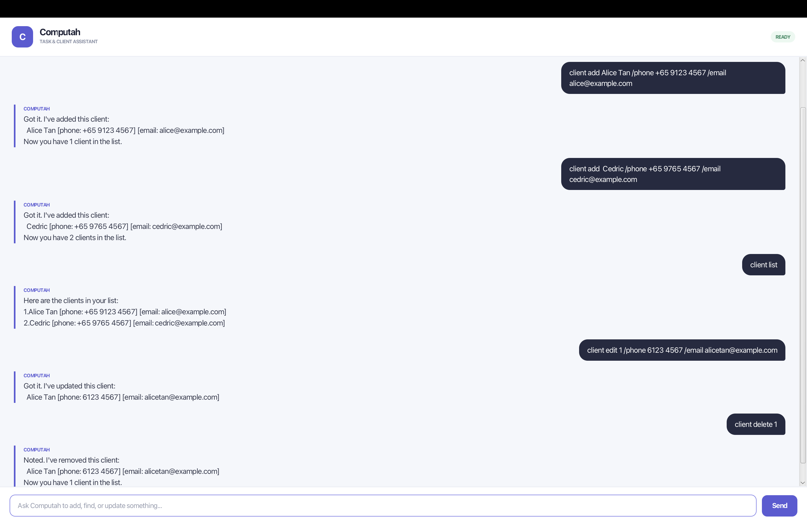

# Computah User Guide

Computah is a desktop chatbot for managing tasks and basic client contact
information through typed commands.



## Table of contents

- [Quick start](#quick-start)
- [Command conventions](#command-conventions)
- [Task commands](#task-commands)
- [Client commands](#client-commands)
- [Data storage](#data-storage)
- [Exiting Computah](#exiting-computah)
- [Command summary](#command-summary)

## Quick start

1. Ensure that Java 25 is installed.
2. Open a terminal in the project directory.
3. Run Computah:

   ```bash
   ./gradlew run
   ```

   On Windows, use `gradlew.bat run` instead.

4. Enter a command in the text box and press <kbd>Enter</kbd> or select
   **Send**.

> [!TIP]
> Start with `todo read book` to add a task, or `client add Alice Tan` to add
> a client.

## Command conventions

- Commands are case-sensitive and should be entered in lowercase.
- Words in `UPPER_CASE` are values that you must supply.
- Items are numbered according to their current position in the relevant list.
- Extra spaces between parts of a command are ignored.
- Dates and times can use any of these formats:
  - `yyyy-MM-dd`
  - `yyyy-MM-dd HHmm`
  - `d/M/yyyy`
  - `d/M/yyyy HHmm`

For example, `2026-09-16 1430` and `16/9/2026 1430` both represent
16 September 2026 at 2:30 PM.

## Task commands

### Adding a to-do

Adds a task without a date or time.

**Format:** `todo DESCRIPTION`

```text
todo read book
```

### Adding a deadline

Adds a task that must be completed by a specified date or time.

**Format:** `deadline DESCRIPTION /by DATE_TIME`

```text
deadline submit report /by 2026-09-20 1800
```

### Adding an event

Adds an event with a start and end. The end cannot be before the start.

**Format:** `event DESCRIPTION /from START_DATE_TIME /to END_DATE_TIME`

```text
event project meeting /from 20/9/2026 1400 /to 20/9/2026 1600
```

### Listing tasks

Displays all tasks in their current order.

**Format:** `list`

```text
list
```

Tasks use the following symbols:

| Symbol | Meaning |
| --- | --- |
| `[T]` | To-do |
| `[D]` | Deadline |
| `[E]` | Event |
| `[ ]` | Not completed |
| `[X]` | Completed |

### Marking a task as completed

**Format:** `mark TASK_NUMBER`

```text
mark 1
```

### Marking a task as not completed

**Format:** `unmark TASK_NUMBER`

```text
unmark 1
```

### Finding tasks

Displays tasks whose descriptions contain the given keyword.

**Format:** `find KEYWORD`

```text
find book
```

### Deleting a task

Deletes the task at the specified list number. Deletion takes effect
immediately and does not ask for confirmation.

**Format:** `delete TASK_NUMBER`

```text
delete 2
```

## Client commands

Client numbers refer to the order shown by `client list`. Phone and email are
optional. The optional fields can appear in either order.

### Adding a client

**Format:** `client add NAME [/phone PHONE] [/email EMAIL]`

```text
client add Alice Tan
client add Alice Tan /phone +65 9123 4567 /email alice@example.com
client add Bob Lee /email bob@example.com
```

### Listing clients

Displays every client in insertion order. A missing phone or email is shown as
`-`.

**Format:** `client list`

```text
client list
```

Example output:

```text
Here are the clients in your list:
1.Alice Tan [phone: +65 9123 4567] [email: alice@example.com]
2.Bob Lee [phone: -] [email: bob@example.com]
```

### Editing a client

Updates one or more fields for an existing client. Fields not included in the
command remain unchanged.

**Format:**
`client edit CLIENT_NUMBER [/name NAME] [/phone PHONE] [/email EMAIL]`

```text
client edit 1 /name Alice Lim
client edit 1 /phone +65 9876 5432 /email alice@company.com
```

Use `-` to clear an optional phone or email field:

```text
client edit 1 /phone -
```

The client name cannot be cleared. Repeating a field or using an unknown field
causes the command to be rejected.

### Deleting a client

Deletes the client at the specified list number. Deletion takes effect
immediately and does not ask for confirmation.

**Format:** `client delete CLIENT_NUMBER`

```text
client delete 2
```

### Client data restrictions

- A client name is required.
- Phone and email values are stored as entered without format validation.
- Leading and trailing whitespace is removed.
- `/name`, `/phone`, and `/email` are reserved field markers and cannot appear
  as text inside a field value.
- Client fields cannot contain line breaks or the text ` | ` because it is
  reserved for the save-file format.
- Multiple clients may have the same details.

## Data storage

Computah saves changes automatically. Tasks are stored in `data/duke.txt`,
while client information is stored separately in `data/clients.txt`.

> [!WARNING]
> Editing either data file manually may prevent Computah from loading the saved
> information correctly.

## Exiting Computah

Ends the current session and disables further input.

**Format:** `bye`

```text
bye
```

## Command summary

| Action | Command format |
| --- | --- |
| Add a to-do | `todo DESCRIPTION` |
| Add a deadline | `deadline DESCRIPTION /by DATE_TIME` |
| Add an event | `event DESCRIPTION /from START_DATE_TIME /to END_DATE_TIME` |
| List tasks | `list` |
| Mark a task | `mark TASK_NUMBER` |
| Unmark a task | `unmark TASK_NUMBER` |
| Find tasks | `find KEYWORD` |
| Delete a task | `delete TASK_NUMBER` |
| Add a client | `client add NAME [/phone PHONE] [/email EMAIL]` |
| List clients | `client list` |
| Edit a client | `client edit CLIENT_NUMBER [/name NAME] [/phone PHONE] [/email EMAIL]` |
| Delete a client | `client delete CLIENT_NUMBER` |
| Exit | `bye` |
